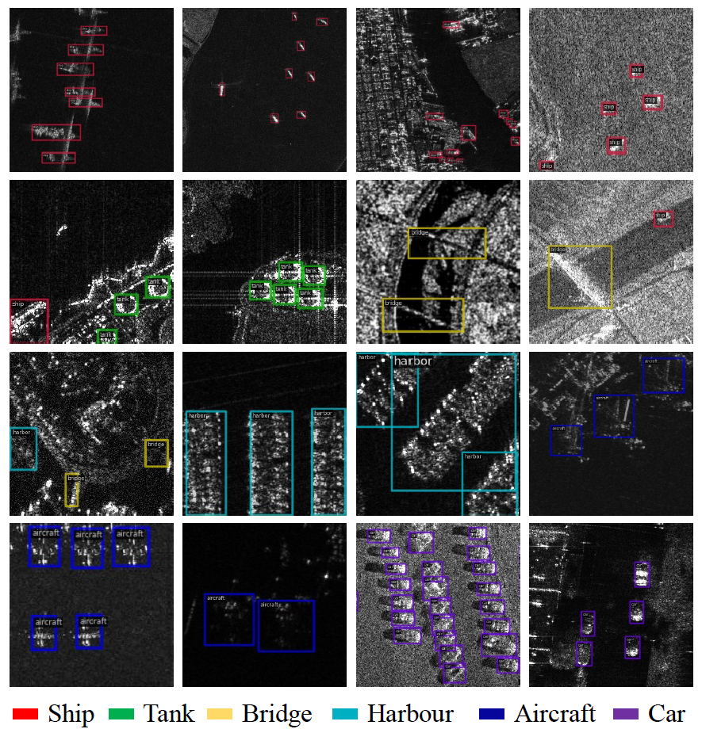

# 📡 SARDet-100K

<div align="center">


### Large-Scale SAR Object Detection Benchmark & Toolkit 🚀

<p align="center">
  <b>SARDet-100K</b> es un benchmark open-source para detección de objetos SAR a gran escala, diseñado para investigación avanzada en visión por computadora y teledetección.
</p>

<p align="center">
  
  
  
  
  
</p>

</div>

---

# ✨ Descripción

SARDet-100K es uno de los datasets más grandes y completos para detección de objetos en imágenes SAR (*Synthetic Aperture Radar*).  

El proyecto busca impulsar la investigación open-source en detección SAR mediante:

- 📦 Dataset multi-clase a escala COCO
- 🧠 Frameworks de entrenamiento y benchmarking
- ⚡ Métodos avanzados como MSFA, RSAR y DenoDet
- 🌍 Compatibilidad con múltiples datasets SAR existentes
- 🔬 Investigación reproducible y abierta

---

# 🧠 Tecnologías Utilizadas

- Python
- PyTorch
- MMDetection
- OpenCV
- CUDA
- NumPy
- Deep Learning
- Computer Vision
- Remote Sensing

---

# 🚀 Características Principales

- 📡 Detección avanzada de objetos SAR
- 🛰️ Compatible con múltiples sensores satelitales
- 📊 Más de 116,000 imágenes SAR
- 🎯 Más de 245,000 instancias etiquetadas
- 🔄 Benchmark multi-clase y multi-dominio
- ⚡ Framework MSFA para pretraining SAR
- 🔍 Soporte para detección rotada
- 🧪 Integración con DenoDet y RSAR
- 📈 Resultados SOTA en benchmarks SAR

---

# 📚 Publicaciones

## 🔥 SARDet-100K — NeurIPS 2024 Spotlight

**SARDet-100K: Towards Open-Source Benchmark and ToolKit for Large-Scale SAR Object Detection**

📄 Paper:
https://arxiv.org/pdf/2403.06534.pdf

---

## 🔥 RSAR — CVPR 2025

**RSAR: Restricted State Angle Resolver and Rotated SAR Benchmark**

📄 Paper:
https://arxiv.org/abs/2501.04440

💻 Código:
https://github.com/zhasion/RSAR

---

## 🔥 DenoDet

**DenoDet: Attention as Deformable Multi-Subspace Feature Denoising for Target Detection in SAR Images**

📄 Paper:
https://arxiv.org/pdf/2406.02833

---

# 🗂️ Dataset

SARDet-100K combina múltiples datasets SAR populares:

- AIR_SARShip
- HRSID
- MSAR
- SADD
- SAR-AIRcraft
- ShipDataset
- SSDD
- OGSOD
- SIVED

---

# 📊 Estadísticas del Dataset

| Métrica | Valor |
|----------|--------|
| Imágenes Totales | 116,598 |
| Instancias Totales | 245,653 |
| Conjunto Train | 94,493 |
| Conjunto Validation | 10,492 |
| Conjunto Test | 11,613 |
| Categorías | Multi-Class |
| Tipo de Datos | SAR Images |

---

# 🛰️ Objetos Detectados

El benchmark incluye múltiples categorías:

- 🚢 Ships
- ✈️ Aircraft
- 🚗 Cars
- 🌉 Bridges
- 🏗️ Harbours
- 🛡️ Tanks

---

# 📥 Descarga del Dataset

## Dataset

### Baidu Disk

```bash
https://pan.baidu.com/s/1dIFOm4V2pM_AjhmkD1-Usw?pwd=SARD
```

### Kaggle / OneDrive

```bash
https://www.kaggle.com/datasets/greatbird/sardet-100k
```

---

# 📥 Model Weights

### Baidu Disk

```bash
https://pan.baidu.com/s/1SuEOl_ImqjoT5Y3pYxZt4w?pwd=c6fo
```

### Kaggle

```bash
https://www.kaggle.com/models/greatbird/msfa
```

---

# ⚙️ Instalación

## Clonar Repositorio

```bash
git clone https://github.com/zhasion/SARDet_100K.git
cd SARDet_100K
```

---

## Crear Entorno Virtual

```bash
python -m venv venv
```

### Linux / macOS

```bash
source venv/bin/activate
```

### Windows

```bash
venv\Scripts\activate
```

---

## Instalar Dependencias

```bash
pip install -r requirements.txt
```

---

# ▶️ Entrenamiento

```bash
python tools/train.py configs/sardet_config.py
```

---

# 🧪 Evaluación

```bash
python tools/test.py configs/sardet_config.py checkpoints/model.pth
```

---

# 📸 Ejemplo del Dataset

<p align="center">
  
</p>

---

# 🧬 Framework MSFA

MSFA (*Multi-Stage with Filter Augmentation*) es un framework diseñado para reducir la diferencia entre:

- Pretraining RGB
- Fine-tuning SAR

Incluye:

- 📊 Adaptación de dominio
- 🔄 Migración de modelos
- 🧠 Filter Augmentation
- ⚡ Mejor generalización SAR

---

# 🌟 Objetivos del Proyecto

- Democratizar la investigación SAR
- Crear benchmarks open-source reales
- Facilitar nuevas publicaciones científicas
- Impulsar investigación en visión remota
- Mejorar modelos de detección SAR

---

# 📂 Estructura del Proyecto

```bash
SARDet_100K/
│
├── configs/
├── datasets/
├── docs/
├── models/
├── tools/
├── checkpoints/
├── MSFA/
├── requirements.txt
└── README.md
```

---

# 🤝 Contribuciones

Las contribuciones son bienvenidas.

1. Fork del proyecto
2. Crear rama feature
3. Commit de cambios
4. Push al repositorio
5. Abrir Pull Request

---

# 📜 Licencia

Este proyecto es open-source y está destinado a investigación académica y científica.

---

# 👨‍💻 Desarrollador

<div align="center">

## Isai Reyes

💻 Desarrollador Full Stack & AI Enthusiast  
🚀 Apasionado por Computer Vision, IA y Open Source

</div>

---

# ⭐ Apoya el Proyecto

Si este proyecto te resulta útil:

- 🌟 Dale una estrella en GitHub
- 🍴 Haz fork del repositorio
- 📢 Compártelo con la comunidad

---

<div align="center">

## 📡 Exploring the Future of SAR Detection

**Open Source • Deep Learning • Remote Sensing • Computer Vision**

</div>
